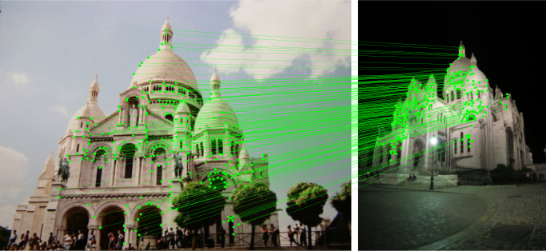
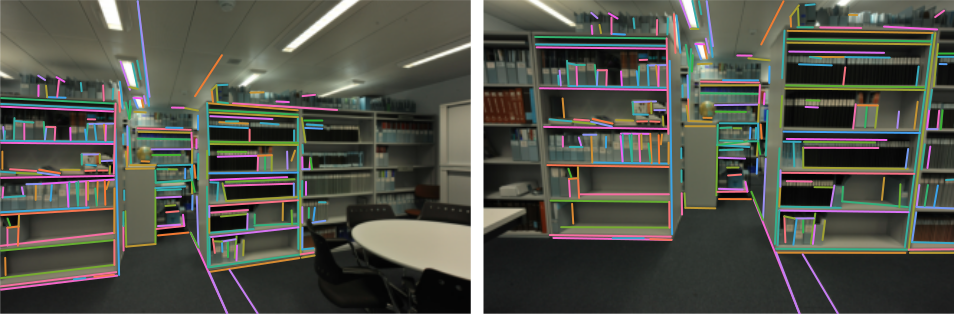

# Glue Factory
Glue Factory is CVG's library for training and evaluating deep neural network that extract and match local visual feature. It enables you to:
- Reproduce the training of state-of-the-art models for point and line matching, like [LightGlue](https://github.com/cvg/LightGlue) and [GlueStick](https://github.com/cvg/GlueStick) (ICCV 2023)
- Train these models on multiple datasets using your own local features or lines
- Evaluate feature extractors or matchers on standard benchmarks like HPatches or MegaDepth-1500

<p align="center">
  <a href="https://github.com/cvg/LightGlue"></a>
  <a href="https://github.com/cvg/GlueStick"></a>
  <br /><em>Point and line matching with LightGlue and GlueStick.</em>
</p>

## Installation
Glue Factory runs with Python 3 and [PyTorch](https://pytorch.org/). The following installs the library and its basic dependencies:
```bash
git clone https://github.com/cvg/glue-factory
cd glue-factory
python3 -m pip install -e .  # editable mode
```
Some advanced features might require installing the full set of dependencies:
```bash
python3 -m pip install -e .[extra]
```

All models and datasets in gluefactory have auto-downloaders, so you can get started right away!

## License
The code and trained models in Glue Factory are released with an Apache-2.0 license. This includes LightGlue and an [open version of SuperPoint](https://github.com/rpautrat/SuperPoint). Third-party models that are not compatible with this license, such as SuperPoint (original) and SuperGlue, are provided in `gluefactory_nonfree`, where each model might follow its own, restrictive license.

## Evaluation

#### HPatches
Running the evaluation commands automatically downloads the dataset, by default to the directory `data/`. You will need about 1.8 GB of free disk space.

<details>
<summary>[Evaluating LightGlue]</summary>

To evaluate the pre-trained SuperPoint+LightGlue model on HPatches, run:
```bash
python -m gluefactory.eval.hpatches --conf superpoint+lightglue-official --overwrite
```
You should expect the following results
```
{'H_error_dlt@1px': 0.3515,
 'H_error_dlt@3px': 0.6723,
 'H_error_dlt@5px': 0.7756,
 'H_error_ransac@1px': 0.3428,
 'H_error_ransac@3px': 0.5763,
 'H_error_ransac@5px': 0.6943,
 'mnum_keypoints': 1024.0,
 'mnum_matches': 560.756,
 'mprec@1px': 0.337,
 'mprec@3px': 0.89,
 'mransac_inl': 130.081,
 'mransac_inl%': 0.217,
 'ransac_mAA': 0.5378}
```

The default robust estimator is `opencv`, but we strongly recommend to use `poselib` instead:
```bash
python -m gluefactory.eval.hpatches --conf superpoint+lightglue-official --overwrite \
    eval.estimator=poselib eval.ransac_th=-1
```
Setting `eval.ransac_th=-1` auto-tunes the RANSAC inlier threshold by running the evaluation with a range of thresholds and reports results for the optimal value.
Here are the results as Area Under the Curve (AUC) of the homography error at  1/3/5 pixels:

| Methods                                                      | DLT         | [OpenCV](../gluefactory/robust_estimators/homography/opencv.py)       | [PoseLib](../gluefactory/robust_estimators/homography/poselib.py)      |
| ------------------------------------------------------------ | ------------------ | ------------------ | ------------------ |
| [SuperPoint + SuperGlue](gluefactory/configs/superpoint+superglue-official.yaml) | 32.1 / 65.0 / 75.7 | 32.9 / 55.7 / 68.0 | 37.0 / 68.2 / 78.7 |
| [SuperPoint + LightGlue](gluefactory/configs/superpoint+lightglue-official.yaml) | 35.1 / 67.2 / 77.6 | 34.2 / 57.9 / 69.9 | 37.1 / 67.4 / 77.8 |


</details>

<details>
<summary>[Evaluating GlueStick]</summary>

To evaluate GlueStick on HPatches, run:
```bash
python -m gluefactory.eval.hpatches --conf gluefactory/configs/superpoint+lsd+gluestick.yaml --overwrite
```
You should expect the following results
```
{"mprec@1px": 0.245,
 "mprec@3px": 0.838,
 "mnum_matches": 1290.5,
 "mnum_keypoints": 2287.5,
 "mH_error_dlt": null,
 "H_error_dlt@1px": 0.3355,
 "H_error_dlt@3px": 0.6637,
 "H_error_dlt@5px": 0.7713,
 "H_error_ransac@1px": 0.3915,
 "H_error_ransac@3px": 0.6972,
 "H_error_ransac@5px": 0.7955,
 "H_error_ransac_mAA": 0.62806,
 "mH_error_ransac": null}
```

Since we use points and lines to solve for the homography, we use a different robust estimator here: [Hest](https://github.com/rpautrat/homography_est/). Here are the results as Area Under the Curve (AUC) of the homography error at  1/3/5 pixels:

| Methods                                                      | DLT         | [Hest](gluefactory/robust_estimators/homography/homography_est.py)       |
| ------------------------------------------------------------ | ------------------ | ------------------ |
| [SP + LSD + GlueStick](gluefactory/configs/superpoint+lsd+gluestick.yaml) | 33.6 / 66.4 / 77.1 | 39.2 / 69.7 / 79.6 |

</details>


#### MegaDepth-1500

Running the evaluation commands automatically downloads the dataset, which takes about 1.5 GB of disk space.

<details>
<summary>[Evaluating LightGlue]</summary>

To evaluate the pre-trained SuperPoint+LightGlue model on MegaDepth-1500, run:
```bash
python -m gluefactory.eval.megadepth1500 --conf superpoint+lightglue-official
# or the adaptive variant
python -m gluefactory.eval.megadepth1500 --conf superpoint+lightglue-official \
    model.matcher.{depth_confidence=0.95,width_confidence=0.95}
```
The first command should print the following results
```
{'mepi_prec@1e-3': 0.795,
 'mepi_prec@1e-4': 0.15,
 'mepi_prec@5e-4': 0.567,
 'mnum_keypoints': 2048.0,
 'mnum_matches': 613.287,
 'mransac_inl': 280.518,
 'mransac_inl%': 0.442,
 'rel_pose_error@10°': 0.681,
 'rel_pose_error@20°': 0.8065,
 'rel_pose_error@5°': 0.5102,
 'ransac_mAA': 0.6659}
```

To use the PoseLib estimator:

```bash
python -m gluefactory.eval.megadepth1500 --conf superpoint+lightglue-official \
    eval.estimator=poselib eval.ransac_th=2.0
```

</details>

<details>
<summary>[Evaluating GlueStick]</summary>

To evaluate the pre-trained SuperPoint+GlueStick model on MegaDepth-1500, run:
```bash
python -m gluefactory.eval.megadepth1500 --conf gluefactory/configs/superpoint+lsd+gluestick.yaml
```

</details>

<details>

Here are the results as Area Under the Curve (AUC) of the pose error at  5/10/20 degrees:

| Methods                                                      | [pycolmap](../gluefactory/robust_estimators/relative_pose/pycolmap.py)         | [OpenCV](../gluefactory/robust_estimators/relative_pose/opencv.py)       | [PoseLib](../gluefactory/robust_estimators/relative_pose/poselib.py)      |
| ------------------------------------------------------------ | ------------------ | ------------------ | ------------------ |
| [SuperPoint + SuperGlue](gluefactory/configs/superpoint+superglue-official.yaml) | 54.4 / 70.4 / 82.4 | 48.7 / 65.6 / 79.0 | 64.8 / 77.9 / 87.0 |
| [SuperPoint + LightGlue](gluefactory/configs/superpoint+lightglue-official.yaml) | 56.7 / 72.4 / 83.7 | 51.0 / 68.1 / 80.7 | 66.8 / 79.3 / 87.9 |
| [SIFT (2K) + LightGlue](gluefactory/configs/sift+lightglue-official.yaml) | ? / ? / ? | 43.5 / 61.5 / 75.9 | 60.4 / 74.3 / 84.5 |
| [SIFT (4K) + LightGlue](gluefactory/configs/sift+lightglue-official.yaml) | ? / ? / ? | 49.9 / 67.3 / 80.3 | 65.9 / 78.6 / 87.4 |
| [ALIKED + LightGlue](gluefactory/configs/aliked+lightglue-official.yaml) | ? / ? / ? | 51.5 / 68.1 / 80.4 | 66.3 / 78.7 / 87.5 |
| [SuperPoint + GlueStick](gluefactory/configs/superpoint+lsd+gluestick.yaml) | 53.2 / 69.8 / 81.9 | 46.3 / 64.2 / 78.1 | 64.4 / 77.5 / 86.5 |

</details>


#### ETH3D

The dataset will be auto-downloaded if it is not found on disk, and will need about 6 GB of free disk space.

<details>
<summary>[Evaluating GlueStick]</summary>

To evaluate GlueStick on ETH3D, run:
```bash
python -m gluefactory.eval.eth3d --conf gluefactory/configs/superpoint+lsd+gluestick.yaml
```
You should expect the following results
```
AP: 77.92
AP_lines: 69.22
```

</details>

#### Image Matching Challenge 2021
Coming soon!

#### Image Matching Challenge 2023
Coming soon!

#### Visual inspection
<details>
To inspect the evaluation visually, you can run:

```bash
python -m gluefactory.eval.inspect hpatches superpoint+lightglue-official
```

Click on a point to visualize matches on this pair.

To compare multiple methods on a dataset:

```bash
python -m gluefactory.eval.inspect hpatches superpoint+lightglue-official superpoint+superglue-official
```

All current benchmarks are supported by the viewer.
</details>

Detailed evaluation instructions can be found [here](./docs/evaluation.md).

## Training

We generally follow a two-stage training:
1. Pre-train on a large dataset of synthetic homographies applied to internet images. We use the 1M-image distractor set of the Oxford-Paris retrieval dataset. It requires about 450 GB of disk space.
2. Fine-tune on the MegaDepth dataset, which is based on PhotoTourism pictures of popular landmarks around the world. It exhibits more complex and realistic appearance and viewpoint changes.  It requires about 420 GB of disk space.

All training commands automatically download the datasets.

<details>
<summary>[Training LightGlue]</summary>

We show how to train LightGlue with [SuperPoint](https://github.com/magicleap/SuperPointPretrainedNetwork).
We first pre-train LightGlue on the homography dataset:
```bash
python -m gluefactory.train sp+lg_homography \  # experiment name
    --conf gluefactory/configs/superpoint+lightglue_homography.yaml
```
Feel free to use any other experiment name. By default the checkpoints are written to `outputs/training/`. The default batch size of 128 corresponds to the results reported in the paper and requires 2x 3090 GPUs with 24GB of VRAM each as well as PyTorch >= 2.0 (FlashAttention).
Configurations are managed by [OmegaConf](https://omegaconf.readthedocs.io/) so any entry can be overridden from the command line.
If you have PyTorch < 2.0 or weaker GPUs, you may thus need to reduce the batch size via:
```bash
python -m gluefactory.train sp+lg_homography \
    --conf gluefactory/configs/superpoint+lightglue_homography.yaml  \
    data.batch_size=32  # for 1x 1080 GPU
```
Be aware that this can impact the overall performance. You might need to adjust the learning rate accordingly.

We then fine-tune the model on the MegaDepth dataset:
```bash
python -m gluefactory.train sp+lg_megadepth \
    --conf gluefactory/configs/superpoint+lightglue_megadepth.yaml \
    train.load_experiment=sp+lg_homography
```

Here the default batch size is 32. To speed up training on MegaDepth, we suggest to cache the local features before training (requires around 150 GB of disk space):
```bash
# extract features
python -m gluefactory.scripts.export_megadepth --method sp --num_workers 8
# run training with cached features
python -m gluefactory.train sp+lg_megadepth \
    --conf gluefactory/configs/superpoint+lightglue_megadepth.yaml \
    train.load_experiment=sp+lg_homography \
    data.load_features.do=True
```

The model can then be evaluated using its experiment name:
```bash
python -m gluefactory.eval.megadepth1500 --checkpoint sp+lg_megadepth
```

You can also run all benchmarks after each training epoch with the option `--run_benchmarks`.

</details>

<details>
<summary>[Training GlueStick]</summary>

We first pre-train GlueStick on the homography dataset:
```bash
python -m gluefactory.train gluestick_H --conf gluefactory/configs/superpoint+lsd+gluestick-homography.yaml --distributed
```
Feel free to use any other experiment name. Configurations are managed by [OmegaConf](https://omegaconf.readthedocs.io/) so any entry can be overridden from the command line.

We then fine-tune the model on the MegaDepth dataset:
```bash
python -m gluefactory.train gluestick_MD --conf gluefactory/configs/superpoint+lsd+gluestick-megadepth.yaml --distributed
```
Note that we used the training splits `train_scenes.txt` and `valid_scenes.txt` to train the original model, which contains some overlap with the IMC challenge. The new default splits are now `train_scenes_clean.txt` and `valid_scenes_clean.txt`, without this overlap.

</details>

### Available models
Glue Factory supports training and evaluating the following deep matchers:
| Model     | Training? | Evaluation? |
| --------- | --------- | ----------- |
| [LightGlue](https://github.com/cvg/LightGlue) | ✅         | ✅           |
| [GlueStick](https://github.com/cvg/GlueStick) | ✅         | ✅           |
| [SuperGlue](https://github.com/magicleap/SuperGluePretrainedNetwork) | ✅         | ✅           |
| [LoFTR](https://github.com/zju3dv/LoFTR)     | ❌         | ✅           |

Using the following local feature extractors:

| Model     | LightGlue config |
| --------- | --------- |
| [SuperPoint (open)](https://github.com/rpautrat/SuperPoint) | `superpoint-open+lightglue_{homography,megadepth}.yaml` |
| [SuperPoint (official)](https://github.com/magicleap/SuperPointPretrainedNetwork) | `superpoint+lightglue_{homography,megadepth}.yaml` |
| SIFT (via [pycolmap](https://github.com/colmap/pycolmap)) | `sift+lightglue_{homography,megadepth}.yaml` |
| [ALIKED](https://github.com/Shiaoming/ALIKED) | `aliked+lightglue_{homography,megadepth}.yaml` |
| [DISK](https://github.com/cvlab-epfl/disk) | `disk+lightglue_{homography,megadepth}.yaml` |
| Key.Net + HardNet | ❌ TODO |

## Coming soon
- [ ] More baselines (LoFTR, ASpanFormer, MatchFormer, SGMNet, DKM, RoMa)
- [ ] Training deep detectors and descriptors like SuperPoint
- [ ] IMC evaluations
- [ ] Better documentation

## BibTeX Citation
Please consider citing the following papers if you found this library useful:
```bibtex
@InProceedings{lindenberger_2023_lightglue,
  title     = {{LightGlue: Local Feature Matching at Light Speed}},
  author    = {Philipp Lindenberger and
               Paul-Edouard Sarlin and
               Marc Pollefeys},
  booktitle = {International Conference on Computer Vision (ICCV)},
  year      = {2023}
}
```
```bibtex
@InProceedings{pautrat_suarez_2023_gluestick,
  title     = {{GlueStick: Robust Image Matching by Sticking Points and Lines Together}},
  author    = {R{\'e}mi Pautrat* and
               Iago Su{\'a}rez* and
               Yifan Yu and
               Marc Pollefeys and
               Viktor Larsson},
  booktitle = {International Conference on Computer Vision (ICCV)},
  year      = {2023}
}
```
